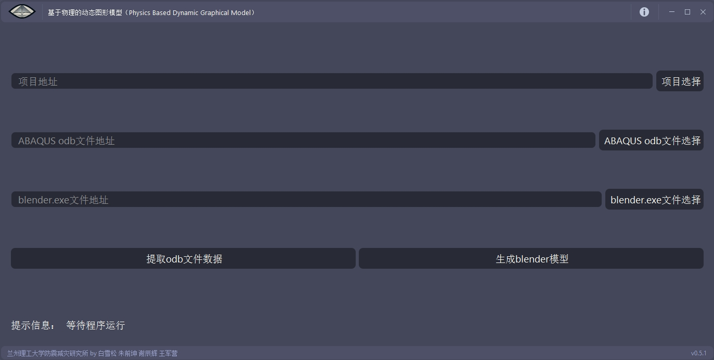
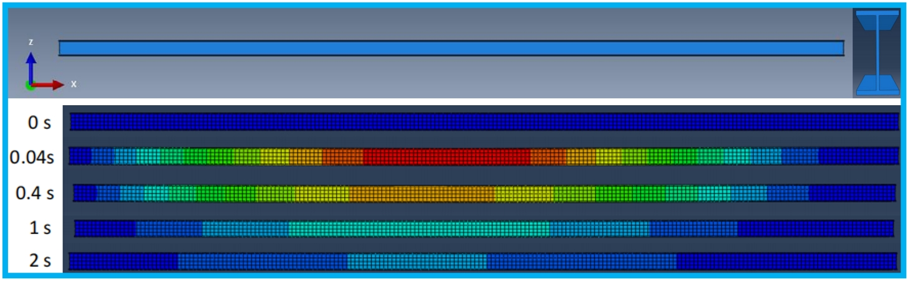
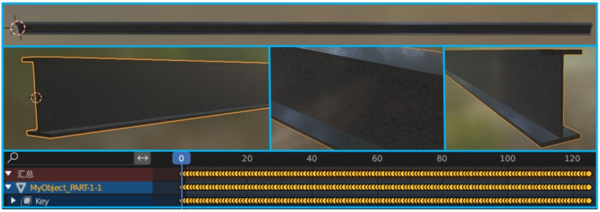
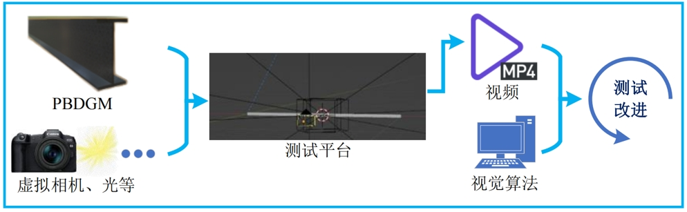
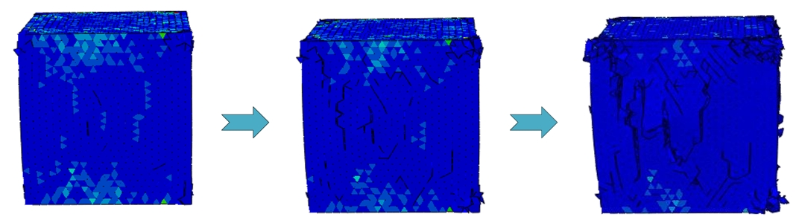
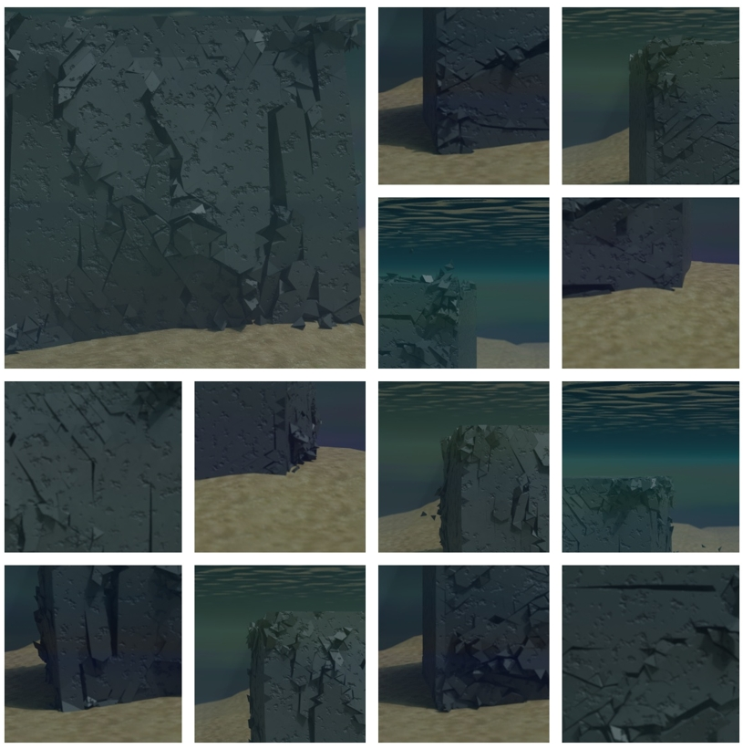

# abaqus-to-blender-PBDGM
This tool converts post-processing models from ABAQUS—including dynamic analysis steps—into dynamic graphical models in Blender, forming Physics-Based Dynamic Graphical Models (PBDGM) for vision algorithm simulation and visual dataset generation.

PBDGM是在传统的基于物理的图形模型（PBGM）基础上，引入了关键的形状变形帧，使得物理动力学分析全过程被完整集成至图形模型中，从而实现了更真实的动态仿真效果。

本工具可将 ABAQUS 有限元软件中的后处理模型（包含动力分析步）自动转换为 Blender 中可视化的动态图形模型，以生成PBDGM。生成的PBDGM不仅具备完整的变形和位移信息，还可用于有限元提取的对比数据，辅助验证视觉算法在真实场景下的准确性与鲁棒性，也可以用于生成视觉数据集。

### 工具 GUI

### PBDGM 创建过程

### PBDGM 用于测试算法/生成数据集

## 👥 贡献

> **朱前坤** — 兰州理工大学土木工程学院/兰州理工大学防震减灾研究所
> 
> **白雪松** — 兰州理工大学土木工程学院
> 
> **谢辰辉** — 兰州理工大学土木工程学院
> 
> **王军营** — 兰州理工大学土木工程学院

## 参考

[1] Bai X, Zhu Q, Wang X, et al. Modal-Weighted Super-Sensitive phase optical flow method for structural Micro-Vibration modal identification[J]. Mechanical Systems and Signal Processing, 2025, 224: 112095.
